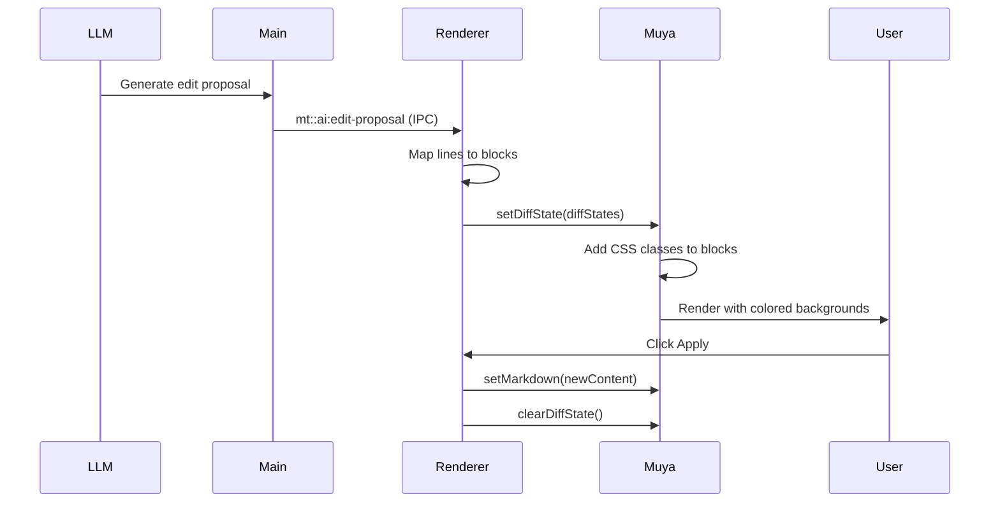

# Inline Diff Implementation - Final Summary

## 🎯 Problem Statement

**User Question**: "How is the diff displayed anyway? Do we dirty the real file? Or inject phantom blocks into Muya?"

## ✅ Answer: CSS Class Injection (Not Phantom Blocks)

The diff is displayed by **injecting CSS classes into existing Muya blocks**, NOT by:
- ❌ Modifying the actual file
- ❌ Adding phantom blocks
- ❌ Changing the markdown content

## 🏗️ Implementation Architecture

### **1. Proposal Flow**
```
LLM → Main Process → IPC → Renderer → Muya Blocks → CSS Classes
```

### **2. Technical Details**

**Step 1: LLM Generates Proposal**
```typescript
{
  edit: {
    id: 'edit-123',
    filePath: 'README.md',
    start: 1,
    end: 50,
    newContent: '# New Title\n...'
  },
  oldContent: '# Old Title\n...'
}
```

**Step 2: Main Process Sends IPC**
```typescript
mainWindow.webContents.send('mt::ai:edit-proposal', proposal)
```

**Step 3: Renderer Receives & Maps to Blocks**
```typescript
// Map line range to Muya block keys
const diffStates: IBlockDiffState[] = []
for (const block of blocks) {
  if (block overlaps with edit range) {
    diffStates.push({
      blockKey: block.key,
      editId: 'edit-123',
      changeType: 'modified'
    })
  }
}
```

**Step 4: Apply to Muya**
```typescript
muya.contentState.setDiffState(diffStates)
```

**Step 5: Muya Renders with CSS**
```javascript
// In renderLeafBlock.js
const diffStates = this.muya.contentState.diffState?.get(key) || []
if (diffStates.length > 0) {
  selector += '.ag-diff-modified'  // CSS class
}
```

**Step 6: CSS Styling**
```css
.ag-diff-modified {
  background-color: rgba(255, 193, 7, 0.14);  /* Amber */
}
```

## 🎨 Visual Result

```
┌────────────────────────────────────────────────────────────┐
│ ✏️ 1 pending edit in README.md   [Apply] [Reject]          │
└────────────────────────────────────────────────────────────┘

# Old Title          ← No highlighting (unchanged)
Some content...      ← No highlighting (unchanged)
~~This line removed~~ ← 🔴 Red background (removed)
This line added      ← 🟢 Green background (added)
```

## 🔧 Key Components

### **Files Modified**

| File | Purpose |
|------|---------|
| `editor.vue` | Receives proposals, maps to blocks, applies diff state |
| `AgentProposalController.vue` | Updates agent store, handles apply events |
| `agentEditorApply.ts` | Applies edits to Muya via `setMarkdown()` |
| `renderLeafBlock.js` | Checks diff state and adds CSS classes |
| `default.css` | Defines diff color styles |

### **Data Flow**



## 🛡️ Security & Safety

### **What We DON'T Do**
- ❌ Modify file until user confirms
- ❌ Execute arbitrary code
- ❌ Access files outside project scope
- ❌ Expose tool execution to renderer

### **What We DO**
- ✅ Validate file paths in main process
- ✅ Use exact path matching (no wildcards)
- ✅ Keep filesystem access in main process
- ✅ Require user confirmation before applying

## 🎯 Why This Approach?

### **Benefits**
1. **Non-destructive**: File unchanged until apply
2. **Efficient**: Uses existing Muya infrastructure
3. **Accurate**: Highlights exact blocks
4. **Reversible**: Can clear without affecting content
5. **Undo-friendly**: Works with Muya's history

### **VSCode Comparison**
- Similar to VSCode's source control diff
- Colored backgrounds on changed lines
- Inline in editor, not separate panel
- Apply/Reject actions

## 🚀 Current Status

### **Fixed Issues**
- ✅ Removed duplicate listeners
- ✅ Fixed file path matching (exact match)
- ✅ Separated store updates from visual diff
- ✅ Added comprehensive logging

### **Next Steps**
1. Restart WordBird
2. Open a markdown file
3. Make an AI edit request
4. Check DevTools console for logs
5. Verify colored backgrounds appear

## 📊 Expected Console Output

```
[Editor] handleAgentEditProposal called
[Editor] Applying visual diff state to Muya
[Editor] Found X blocks in editor
[Editor] Applying diff state to Muya: X blocks
```

## 🎉 Conclusion

The diff is displayed by **injecting CSS classes into existing Muya blocks** - a clean, efficient, and safe approach that provides a VSCode-like inline diff experience without modifying files until the user explicitly applies changes!
